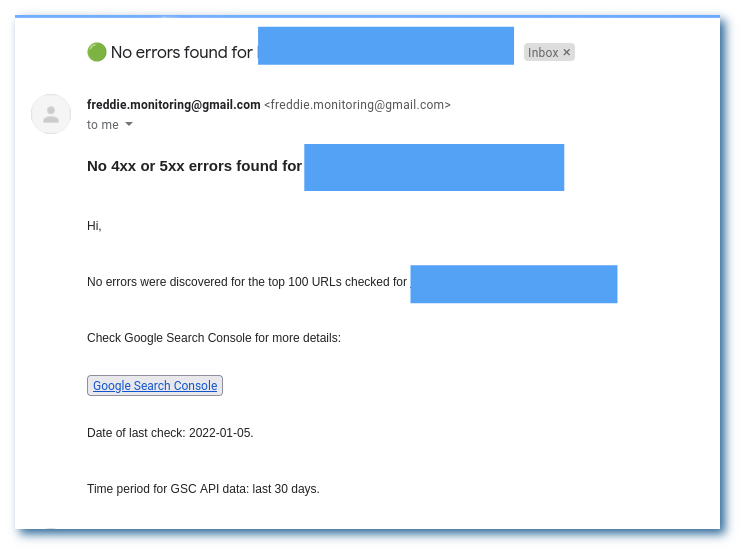
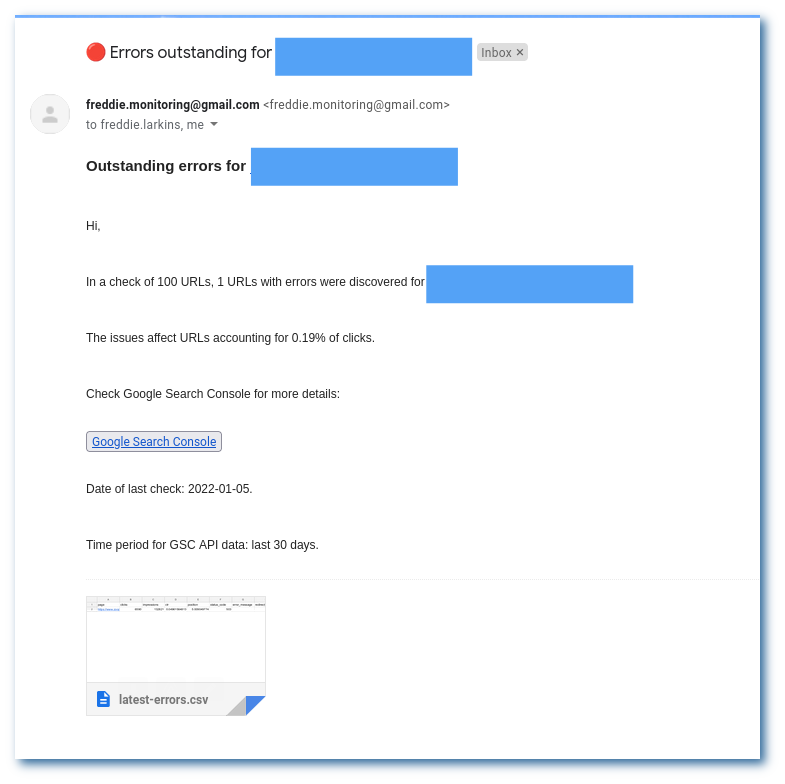

# monitor-top-urls
As the name suggests, this script monitors your most important URLs for 4xx and 5xx errors, plus any unexpected redirects. You'll recieve an email from a dummy address every time the script has executed, notifying you of any errors. 

The script determines which URLs to check by querying Google Search Console for your top X pages over the last month. This way, you're monitoring the pages that matter!

---
## Prerequisites
- A dummy Gmail address from which to send the notification emails (explained below)
- Python 3.7+
- Access to Google Search Console
- Access to a Linux installation
---
## Setup
### 1. Clone the GitHub repo
`git clone https://github.com/fredlarkins/monitor-top-urls.git`  
...Or download the [zip file](https://github.com/fredlarkins/monitor-top-urls/archive/refs/heads/main.zip).
### 2. Create the dummy Gmail account
- [Create a Google account](https://accounts.google.com/signup/v2/webcreateaccount?flowName=GlifWebSignIn&flowEntry=SignUp)
- In the left-hand options panel for your Google Account, click on [`Security`](https://myaccount.google.com/u/2/security) > [`Less secure app access`](https://myaccount.google.com/u/2/lesssecureapps) > Toggle `Allow less secure apps` to `ON`

You'll only be using the account to send emails - so in theory, someone that gains access maliciously will only see some Search Console data and will be able to send emails from that address. These concerns are addressed in the Issues section of the yagmail repo:  [Insecure Gmail access #42](https://github.com/kootenpv/yagmail/issues/42) &  [requires gmail setting to allow less secure apps #29](https://github.com/kootenpv/yagmail/issues/29).

### 2. Create Google Search Console API credentials
- Log in to the [Google Cloud Platform](https://console.cloud.google.com/home/dashboard) using the Google account associated with Search Console
- In the left-hand menu, click on `APIs and services`
- At the top of the page, click on [`+ ENABLE APIS AND SERVICES`](https://console.cloud.google.com/apis/library)
- Search for the Google Search Console API and enable it
- Once enabled, go back to the left-hand menu and click on [`Credentials`](https://console.cloud.google.com/apis/credentials)
- At the top, click on `+ CREATE CREDENTIALS` > `OAuth client ID`
- In the `Application type` dropdown, select `Desktop app`, and name it whatever you want
- Download the json credentials file into the `monitor-top-urls` folder (or whatever you chose to name it!)
---  

## Setting up the virtual environment
In your terminal, navigate to the directory where the repo is saved and run:
```
$ python3 -m venv venv
$ source venv/bin/activate
$ pip3 install -r requirements.txt
```
This will install all the necessary packages for the script to run. Make sure you activate the venv each time you want to use the script!

---

## Usage
The script (app.py) takes a few command line arguments.

```
$ python3 app.py    --property [Google Search Console property]
                    --num-urls [Number of URLs to check]
                    --rate-limit [Rate limit for making HTTP requests]
                    --recipients [email address of email recipient(s)]
```
For instance:
```
$ python3 app.py --property https://www.google.com/ --num-urls 500 --rate-limit 15 --recipients larry.page@google.com sergey.brin@google.com
```
... will check the top 500 URLs by clicks for Google's main GSC property for 4xx and 5xx errors, making requests at a maximum of 15 requests per second, and emailing the founders the results.

*Note: the `rate-limit` and `num-urls` arguments are optional. They are set to 30 RPS and 100 respectively.

---
## Running the script for the first time
The first time you run the script, you'll be asked for your Gmail username (i.e. the first bit of your email address - everything before the @ sign) and your password:
```
$ python3 app.py --xyz
Enter Gmail username >>> my_gmail_username 
Enter Gmail password >>> my_gmail_password
```

*The password will be saved securely in the system keyring service and will not be exposed in your code.*

You will also be given a Google login URL - follow this from your terminal and log in to the account associated with Google Search Console. You'll only have to do this the first time.

---

## Output - what the emails look like
**The all-clear**  
*Screenshot of the email if no errors are detected*


**Errors**  
*Screenshot of the email if errors are detected, with a CSV of the errors attached plus a calculation of the % of clicks affected.*


---

## Known issues with the script
- You may be asked to enter your Gmail password twice on some Linux distros. As long as you choose to save the password to keyring when prompted, this should be the only time you have to enter it.
